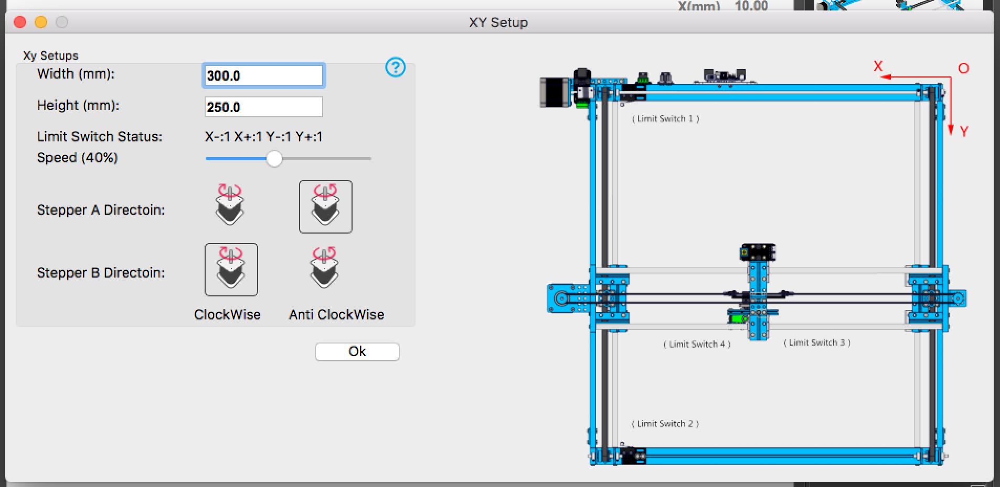

XMas market 2016
=== 

Generative Chrismas Carols
---
Using a combined corpus of text from the site of écal 
and french christmas carols generate new texts for christmass cards.

Inkscape convert text to outlines in terminal
---
First install inkscape with homebrew. Then execute command
`
inkscape untitled.svg --export-text-to-path --export-plain-svg test2.svg
`

Using custom python script to clean svgs
---
`
python svgcleaner.py -i out.svg -o res2.xml
`

Resources
---
[Single line fonts](http://imajeenyus.com/computer/20150110_single_line_fonts/index.shtml)

[Arduino driver IMPORTANT](http://www.mblock.cc/posts/run-makeblock-ch340-ch341-on-mac-os-sierra)

[inkskape temp closed single line fonts](http://myscrappinginspiration.blogspot.ch/2013/07/how-to-use-temporary-closed-single-line.html)
